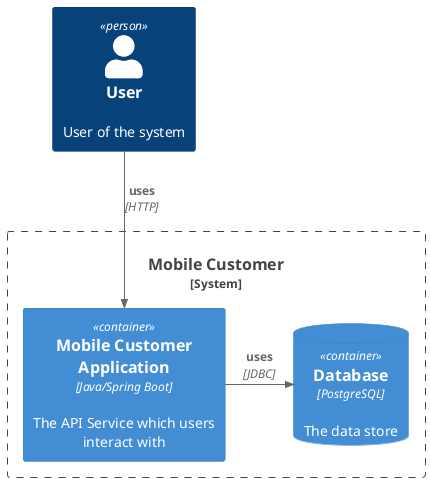
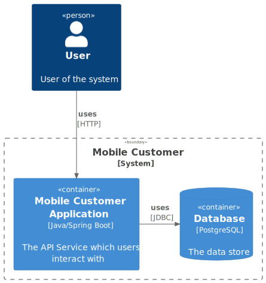
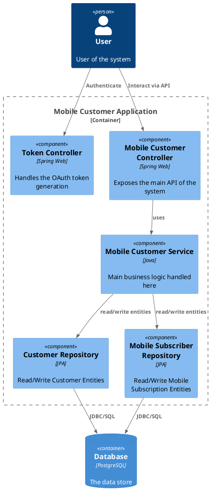
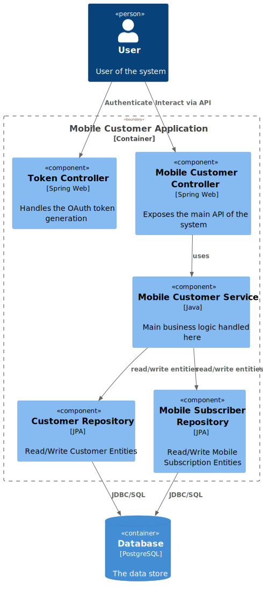

# Mobile Customer Service

## About
This RESTful Web Service keeps track of Customers, and their Mobile Subscriptions.

## Explanation
This is a generic demonstration system developed in Spring Boot, which exposes a simple API for managing Customers and their Mobile Subscriptions in a Database.

<!--

-->


## How to use

### Startup
The system is provided as Docker/OCI container images, ready for deployment.  A docker-compose file is provided for convenience.

Use the following command to start a local instance.

```sh
# docker-compose up
```

### Authenticate

The API is protected by a OAuth2 Bearer token.  Before using the various API endpoints a `TOKEN` must be acquired from the `/token` endpoint provided by the service.

> **WARNING**
> This method of token generation is for demonstration purposes only.  A proper service should make use of a standard OIDC Authorization Server to manage users/roles/token generation.
>
> The username and password is also hardcoded into the application, again for demonstration purposes only!

```sh
# export TOKEN=`curl -u user:password http://localhost:8080/token`
```

### Explore the API

Now the various API calls can be called.  The service exposes the API documentation on http://localhost:8080/v3/api-docs.  A local copy has also been saved into the `openapi3.json` file in this repo.

This file can be uploaded to a service like https://redocly.github.io/redoc/ to get a better view, or imported to a tool like [Postman](https://www.postman.com/) to work with it.

## The details

### Application internal structure

This application consists of the following components which handle the logic in the application.

<!--

-->


